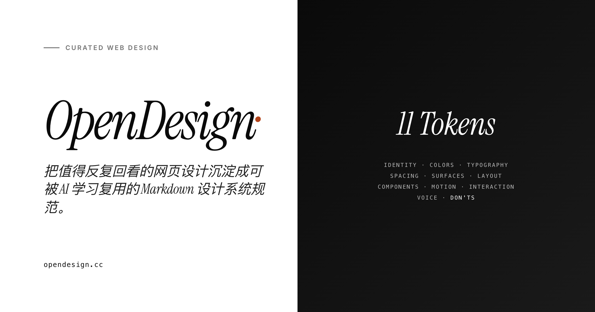

<div align="center">



# OpenDesign

**第一个把网页美学拆成可被 AI 学习复用的开源标准。**

✦ 11 层 Tokens · 真 computed styles · AI-ready · 全开源

[](LICENSE)
[](LICENSE)
[](https://opendesign.cc)
[](.github/ISSUE_TEMPLATE/propose-site.yml)

[Demo](https://opendesign.cc) · [11-layer Spec 标准](docs/11-layer-spec.md) · [AI Agent 集成](docs/ai-agent-integration.md) · [部署你自己的](docs/deployment.md)

</div>

---

## 这是什么

别的网页美学站只让你**看截图**。OpenDesign 让你**下载到代码 + 数据 + 证据**：

| 别的站给你的 | OpenDesign 给你的 |
|---|---|
| 一张截图 | 17+ 张截图（全页 + 13 段滚动 + 移动）|
| 一句模糊描述 | 8 章 magazine 风格 MD 设计规范 |
| 凭感觉模仿 | 真 `getComputedStyle` 出来的 hex / px / 字体名 |
| 你看完了走了 | 一个 URL 给 AI，自动生成同气质新页面 |

每个收录都附带一个**可下载的设计素材包**：

```
apple-design-pack.zip (38.8 MB)
├── 📄 DESIGN_SPEC.md           8 章规范 · :root CSS 变量可直接粘
├── 🔢 sites-entry.json          11 层 Tokens spec
├── 🔢 summary.json              真 token 频次数据（按出现次数排序）
├── 🔢 fonts.json                实际加载的字体清单 + fallback chain
├── 🖼 01_desktop_full.png      1440 桌面全页 (@2x retina)
├── 🖼 02_desktop_hero.png      桌面首屏
├── 🖼 03_section_00 ~ _12      13 张滚动分段（视觉证据）
├── 🖼 04_mobile_full.png       390 移动全页 (@3x retina)
└── 🖼 05_mobile_hero.png       移动首屏
```

---

## ⚡ For AI agents — 一个 URL = 完整设计上下文

把任意 pack 文件夹 URL 粘进 Claude / Cursor / v0：

```
https://opendesign.cc/packs/apple/
```

AI 自动 fetch → 拿到完整规范 + 截图 + 字体清单**作为一个上下文**，立刻就能按这套气质生成新页面。

```text
你跟 Cursor 说：
   "Build me a landing page following this spec:
    https://opendesign.cc/packs/apple/"

Cursor fetch URL → 看到 :root 变量 / 字体 / 间距 / donts → 直接生成代码
```

→ 详见 [AI Agent 集成文档](docs/ai-agent-integration.md)

---

## 11 层 Tokens：OpenDesign 提倡的开放标准

每个 spec 按相同 11 层组织，AI 学起来稳：

| 层 | 内容 | 例 |
|---|---|---|
| 1. Identity | 一句话定位 + 关键词 + 类比 | "用纯黑剧场让硬件自己演戏" |
| 2. Colors | bg / ink / accent token + 用色原则 | `--bg: #F5F5F7` |
| 3. Typography | 字体类别 + 字号阶 + 规则 | `humanist-sans · 56/44/40/24/21/17/14` |
| 4. Spacing | 基础单位 + 间距阶 + 节奏 | `4px base · 4/8/16/24/32/48/64/96` |
| 5. Surfaces | 圆角 + 阴影 + 边线策略 | "几乎不用阴影，靠 hairline" |
| 6. Layout | 容器宽度 + 栏数 + 骨架 | "1280 max · 12 column" |
| 7. Components | button/card/chip/input/hero 配方 | "按钮黑底白字 pill 48px" |
| 8. Motion | 时长桶 + 缓动 + 模式 | `220/400/800 · cubic-bezier(0.2,0.6,0.2,1)` |
| 9. Interaction | hover / click / focus 规则 | "hover translateY -4px + 阴影" |
| 10. Voice | 语气 + 标题写法 + CTA 风格 | "Order / Reserve · 1 词动词" |
| 11. Don'ts | 反向定义的禁用清单 | "不用 emoji · 不放 carousel" |

加 12. **System Prompt** —— 把整套压成 250 字内可直接喂 AI 的指令。

→ 完整标准定义：[docs/11-layer-spec.md](docs/11-layer-spec.md)

---

## 三个使用方式

### 🎨 设计师 / 前端开发：浏览 + 下载
访问 **[opendesign.cc](https://opendesign.cc)**，挑一个网站，点「↓ 下载素材包」拿走全套素材。

### 🛠 Curator：抽取自己的网站
```bash
git clone https://github.com/qiuyiwu1989-star/opendesign
cd opendesign/extract
./setup.sh
python3 extract.py https://your-site.com
python3 synthesize.py extracts/your-site-com
./pack.sh extracts/your-site-com
```

输出：完整设计素材 ZIP，结构同 OpenDesign 公开 pack。

### 🤖 AI 工具构建者：基于 packs/ URL 协议
任何 LLM 工具都可以约定：
- 用户输入 `https://opendesign.cc/packs/<slug>/` 当作 "design context input"
- 工具自动 fetch 该目录的 DESIGN_SPEC.md + 关键文件
- 按照规范生成代码

→ [AI Agent 集成文档](docs/ai-agent-integration.md) 含完整 Cursor / Claude / v0 调用范例

---

## Quick links

- 🌐 **[opendesign.cc](https://opendesign.cc)** — 20+ 精选 + 5 个 pack 就绪
- 📚 [11-layer Tokens 开放标准](docs/11-layer-spec.md)
- 🤖 [AI Agent 集成指南](docs/ai-agent-integration.md)
- ⚙️ [架构总览](docs/architecture.md)
- 🚀 [部署你自己的实例](docs/deployment.md)
- 🗄️ [Supabase 配置](docs/supabase.md)
- 🛠 [Extract CLI 工具](extract/README.md)
- 🤝 [提名一个网站](.github/ISSUE_TEMPLATE/propose-site.yml)（推荐你认为值得收录的）

---

## 当前状态

- ✅ **20 个高质量种子站** —— Apple / Linear / Stripe / Vercel / Framer / Arc / Raycast / Cosmos / Mobbin / etc.
- ✅ **16 个 AI 生成 spec**（mimo-v2.5 vision）
- ✅ **5 个完整 pack 可下载**（Apple, Linear, Lusion, Arc, Stripe Press）
- ✅ **中英双语 UI**
- ✅ **Supabase 收藏 / 点赞云同步**
- ✅ **SEO + GEO 完整**（sitemap / robots / llms.txt）
- 🚧 补完剩余 15 个 pack
- 🚧 每条独立 SEO 详情页
- 🚧 社区投稿审核工作流

→ 完整路线图：[ROADMAP.md](ROADMAP.md)

---

## 技术栈

- **前端**：原生 HTML + CSS + JS（零依赖，零构建步骤）
- **字体**：Instrument Serif italic + Inter
- **后端**：Supabase（Postgres + Edge Function）
- **抓取**：Playwright + Python 统计聚合
- **AI Vision**：mimo-v2.5（也兼容 Claude Sonnet / OpenAI vision via Anthropic-format proxy）
- **部署**：Nginx + Let's Encrypt + 腾讯云

→ 架构详解：[docs/architecture.md](docs/architecture.md)

---

## 贡献

OpenDesign 接受三种贡献：

1. **提名新网站** —— [开 issue 用模板](.github/ISSUE_TEMPLATE/propose-site.yml) · 1 分钟搞定
2. **改进现有 spec** —— 直接 PR 改 `sites.js` 或 `sites-specs.json` 对应条目
3. **完善文档 / 工具 / 翻译** —— 任何 PR

详情：[CONTRIBUTING.md](CONTRIBUTING.md)

---

## 引用

如果你用了 OpenDesign 的 spec / pack / 工具，欢迎告诉我们。学术引用：

```bibtex
@misc{opendesign2026,
  title  = {OpenDesign: an open standard for extracting reusable web
           design tokens via Playwright + Vision LLM},
  author = {Qiu, Yiwu and OpenDesign contributors},
  year   = {2026},
  url    = {https://opendesign.cc}
}
```

---

## License

- **Code**: MIT
- **Curated specs**: CC BY 4.0（自由复用、可商用、保留署名）
- **Original sites' assets**: © respective owners

详见 [LICENSE](LICENSE)

---

<div align="center">

Made with ✦ by [Qiu Yiwu](https://qiuyiwu.com)

</div>
