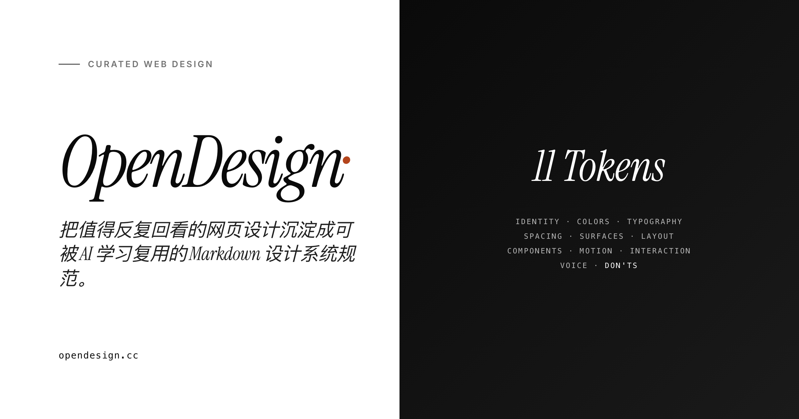

<div align="center">



# OpenDesign

### 给 AI 造的软件补上「品味」这一层。

**1,486 个真实设计系统。可验证的 tokens,不是感觉。一行接入。**

[](LICENSE)
[](LICENSE)
[](https://opendesign.cc)
[](https://opendesign.cc/mcp/)

[在线站点](https://opendesign.cc) · [MCP 接入](https://opendesign.cc/mcp/) · [Agent 协议](https://opendesign.cc/skill.md) · [English](README.md)

</div>

---

## 问题

让任何 AI 给你做个落地页,你会拿到:Inter 字体、蓝紫渐变主视觉、满屏 `rounded-2xl`、每张卡片一层柔和阴影。

这不是 bug。**这是训练数据的数学平均值**——而平均值没有品牌。于是所有 AI 做出来的页面,长得都一样。

这个问题 prompt 解决不了。「做得高级一点」不可执行,丢张截图不可验证,模型最后还是回落到均值。

## 解法

在生成的那一刻,把**一个真实设计系统的实际数值**交给 Agent。

```
"做个让人觉得可信的 fintech 面板"
        ↓
  recommend_references()    → 1 个主推 + 2 个备选,故意来自不同美学家族
        ↓
  get_design_system("...")  → 那个站的真实 tokens
        ↓
  { bg: "#08090A", ink: "#F7F8F8", muted: "#62666D",
    line: "rgba(255,255,255,0.08)", scale: [...], motion: {...} }
        ↓
  每个值都能追溯到真人做过、真实用户信任过的设计。
```

不是「Stripe 那种蓝」,是 Stripe 实际在用的那个 hex。

## 接入

**远程 —— 什么都不用装:**

```json
{ "mcpServers": { "opendesign": { "url": "https://opendesign.cc/mcp/http" } } }
```

**本地 —— 零依赖 Node:**

```json
{ "mcpServers": { "opendesign": { "command": "npx", "args": ["-y", "opendesign-mcp"] } } }
```

Claude Desktop / Claude Code / Cursor / Windsurf,任何 MCP 客户端都能用。不用注册、不用 API key、不计费。

**不用 MCP 也行**:全部静态公开。`GET https://opendesign.cc/skill.md` 能把任何 Agent 变成设计总监;`catalog.json`、`packs/<slug>/spec.json`、`llms.txt` 都是普通 fetch。

## 7 个工具

| 工具 | 作用 |
|---|---|
| `get_director_protocol` | **先读这个。** 总监协议:诊断需求 → 给出观点 → 路由到参照 → 拆解成可执行 |
| `recommend_references` | 给一句需求,返回 1 主推 + 2 备选,**强制来自不同美学家族**(安全/大胆/意外),代码层保证不给你三个雷同的 |
| `get_design_system` | **核心工具。** 某个站的真实 grounded tokens |
| `search_designs` | 打分排序检索。**会明确告诉你哪些查询词一个都没命中**,而不是默默返回噪声 |
| `list_designs` | 浏览目录 |
| `fetch_design_spec_markdown` | 完整规范的 Markdown,5 语言——可直接粘进 prompt |
| `get_critique_rubric` | 5 维设计评审量表,回答「这设计到底行不行」 |

## 为什么这些 tokens 可信

每一条都是用 Playwright 驱动真实浏览器、在真实 DOM 上读 `getComputedStyle`、按频次聚合,再用这些实测数据去校准视觉模型的判断。**数字是量出来的,不是回忆出来的。**

| | 一般的灵感画廊 | OpenDesign |
|---|---|---|
| 你拿到什么 | 一张截图 | 机器可读的 token 规范 |
| 颜色 | 自己用取色器吸 | 真实 hex,按出现频次排序 |
| 字体 | 「看着像个无衬线」 | 真实字阶:字号/行高/字重/字距 |
| 动效 | — | 时长分档 + 缓动曲线 |
| 反面清单 | — | 每个站明确的 **don'ts** |
| 对 Agent | 没法用 | 一次 fetch = 完整设计上下文 |

**1,486 站** · **920** 个带完整 Playwright 截图包 · **5 语言** · 每站边际成本 **~$0.10**

## 一份规范里到底有什么

两种产物、两种形状——下面的数字是你打开文件真能数出来的，不是路线图。

**`spec.json` —— 全部 1,486 个站，6 层实测 token：**

`colors · typography · spacing · surfaces · layout · motion`

每个值都由 Playwright + `getComputedStyle` 从真实页面读出，再对着测量值校准。这里没有一项是模型对这个网站的"印象"。

**`DESIGN.md` —— 有完整素材包的 920 个站，9 个章节：**

`Overview · Colors · Typography · Layout · Elevation & Depth · Shapes · Components · Do's and Don'ts · System Prompt`

多出来的是需要解读的部分——组件配方、禁用清单、可直接粘贴的 system prompt——它们依赖素材包管线产出的截图。

所有站同一套结构，Agent 学会读一个就等于学会读全部。→ [各层定义](docs/11-layer-spec.md)

```jsonc
// GET https://opendesign.cc/packs/linear/spec.json
{
  "colors": { "bg": "#08090A", "ink": "#F7F8F8", "muted": "#62666D",
              "line": "rgba(255,255,255,0.08)",
              "principle": "极端对比制造聚焦,用细微噪点和半透明层次做深度。" },
  "typography": { "display": "grotesque-sans", "scale": [ /* 字号/行高/字重/字距 */ ] },
  "spacing": { "base": 4, "scale": [4, 8, 16, 24, 32, 48, 64, 96] },
  "motion": { /* 时长 + 缓动 */ },
  "surfaces": { /* 圆角、层次策略 */ }
}
```

## 人也能用

访问 [opendesign.cc](https://opendesign.cc)——无限画布浏览、5 语言详情页、可下载的设计素材包(规范 + tokens + 真实截图打包成 ZIP)。

## 自己跑一套

```bash
git clone https://github.com/qiuyiwu1989-star/opendesign
cd opendesign/extract && ./setup.sh
python3 extract.py https://your-site.com          # 驱动浏览器,实测 DOM
python3 synthesize.py extracts/your-site-com      # → spec.json + DESIGN.md
./pack.sh extracts/your-site-com                  # → 可下载素材包
```

完整管线可自托管:[架构](docs/architecture.md) · [部署](docs/deployment.md) · [数据管线](docs/data-pipeline.md)

## 文档

**概念** — [定位与第一性原理](docs/positioning.md) · [各层定义](docs/11-layer-spec.md) · [素材包标准](docs/design-pack-standard.md)

**Agent 接入** — [MCP 配置](https://opendesign.cc/mcp/) · [Agent 集成](docs/ai-agent-integration.md) · [总监协议](skill/SKILL.md)

**运营** — [收录手册](docs/curator-workflow.md) · [质量门](docs/quality-gate.md) · [踩坑沉淀](docs/lessons-2026-08.md)

## 贡献

1. **提名网站** — [开 issue](.github/ISSUE_TEMPLATE/propose-site.yml),一分钟
2. **修规范** — 发现颜色错了、don'ts 太弱?直接 PR 那一条
3. **其它** — 工具、文档、翻译

选片标准:三页之内能抓住的清晰设计 DNA、能拆成 tokens、对「它拒绝做什么」有主见。不收:内容农场、模板化 SaaS、组件库堆砌。→ [CONTRIBUTING.md](CONTRIBUTING.md)

## License

**代码** MIT · **策展规范** CC BY 4.0(可商用,保留署名)· **原站素材** 版权归各自所有者

<div align="center">

Made with ✦ by [Qiu Yiwu](https://qiuyiwu.com)

</div>
